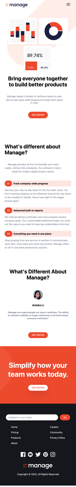

# Tailwind CSS Practice

## Installation

- `npm init -y`
- `npm install -D tailwindcss`
- `npx tailwindcss init`

## Configure and run

- Add scripts `build` and `watch` to `package.json`
- Configure `tailwind.config.js`
- `npm run watch` to constantly watch and build

## Screenshots

### Web

### Mobile

---

